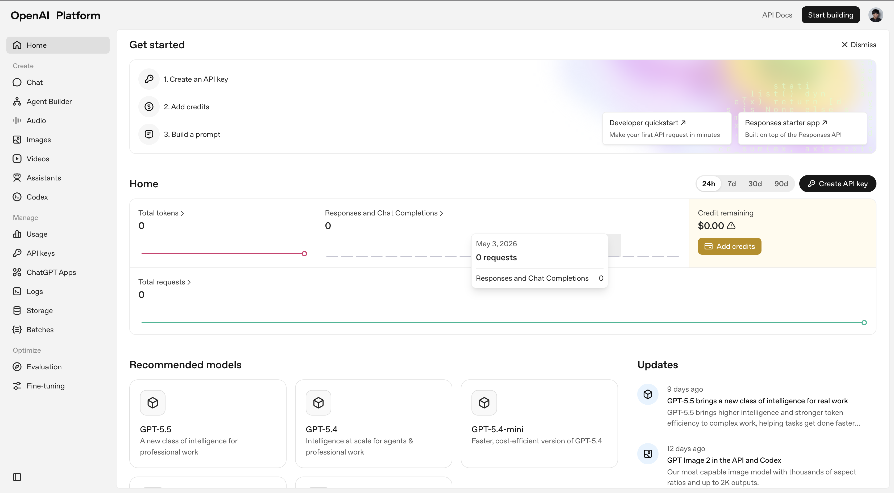

# Design Documentation

## Design Purpose
This document serves as the central reference for the Finexy Dashboard Monitoring Client design system. It outlines the visual language, core components, and aesthetic standards to ensure consistency across the application.

## Brand Color Palette
- **Accent only**: `#ff6301` (Orange)
- **Info / live / success**: `#00a1a6` (Tosca)
- **Error / danger only**: `#e50000` (Red)
- **Primary text and primary CTA**: `#000000` (Black)
- **Backgrounds and cards**: `#ffffff` (White)

Neutral support tones may be used for borders, muted panels, and secondary text, but blue, navy, emerald, purple, and warm-beige branding should be treated as legacy.

## Visual Direction
- Keep layouts light, structured, and data-first.
- Use white cards with thin neutral borders and restrained shadows.
- Use orange as an accent, not as a default surface color.
- Use tosca only for live, info, or positive states.
- Use red only for destructive or error states.
- Avoid decorative gradients that overpower the data layer.

## Mobile Behavior
- Content stacks vertically on smaller screens.
- Desktop sidebars collapse into a drawer or hidden navigation fallback.
- Avoid horizontal scrolling wherever possible.
- Keep important actions visible near the top of each screen.

## Reference Images
- **Visual Source of Truth**: 
- **Path**: `docs/references/dashboard-reference.png`

> [!IMPORTANT]
> The screenshot located at `docs/references/dashboard-reference.png` is the absolute visual source of truth for all UI/UX implementations.
